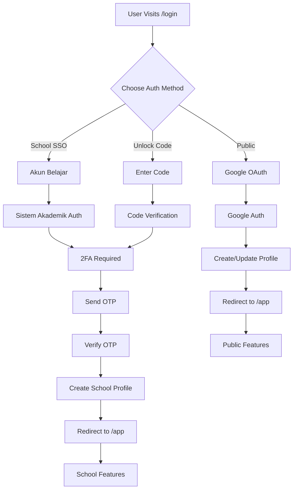

# 🔐 Dual Authentication Strategy - Technical Implementation

> **Comprehensive guide for implementing dual authentication in We Will Shine**  
> _Supporting both public access (Google OAuth) and school-affiliated access (Sistem Akademik)_

---

## 📋 Table of Contents

1. [Overview](#overview)
2. [Authentication Architecture](#authentication-architecture)
3. [Google OAuth Implementation](#google-oauth-implementation)
4. [School SSO Implementation](#school-sso-implementation)
5. [Unlock Code System](#unlock-code-system)
6. [2FA Implementation](#2fa-implementation)
7. [User Profile Management](#user-profile-management)
8. [Security Considerations](#security-considerations)
9. [Database Schema](#database-schema)
10. [API Endpoints](#api-endpoints)
11. [Frontend Implementation](#frontend-implementation)
12. [Testing Strategy](#testing-strategy)

---

## 🎯 Overview

### **Authentication Goals**

1. **Flexibility**: Support multiple authentication methods
2. **Security**: Implement proper 2FA for school users
3. **User Experience**: Seamless login flow for both paths
4. **Privacy**: Respect user data ownership
5. **Scalability**: Handle growth from 100 to 1M+ users

### **Authentication Methods**

```
┌─────────────────────────────────────────────────────┐
│  Public Access (B2C)                                │
│  └─ Google OAuth (Primary)                          │
│                                                     │
│  School Access (B2B)                                │
│  ├─ School SSO (Akun Belajar)                      │
│  └─ Unlock Code (Admin Generated)                  │
│                                                     │
│  Security Layer                                      │
│  └─ 2FA (Email/SMS) for school users only           │
└─────────────────────────────────────────────────────┘
```

---

## 🏗️ Authentication Architecture

### **High-Level Flow**



### **Authentication State Management**

```typescript
// Authentication state
interface AuthState {
	user: User | null;
	isAuthenticated: boolean;
	authMethod: 'google' | 'schoolSSO' | 'unlockCode' | null;
	isLoading: boolean;
	error: string | null;
}

// User profile (unified)
interface User {
	id: string;
	email: string;
	name: string;
	avatar?: string;

	// Authentication metadata
	authType: 'google' | 'schoolSSO' | 'unlockCode';
	authProvider: string;
	lastLogin: Date;

	// Public user data
	googleId?: string;

	// School user data
	schoolId?: string;
	studentId?: string;
	class?: string;
	grade?: string;
	schoolName?: string;

	// Feature permissions
	permissions: {
		personalRoadmap: boolean;
		aiMentor: boolean;
		mentalHealth: boolean;
		schoolSync: boolean;
		communityAgents: boolean;
		agentBuilder: boolean;
	};

	// Privacy settings
	privacy: {
		dataSharing: 'private' | 'school' | 'community';
		analytics: boolean;
		marketing: boolean;
	};

	// LLM configuration
	llmConfig: {
		provider: 'gemini' | 'openai' | 'claude' | 'ollama' | 'school';
		apiKey?: string; // Encrypted
		useSchoolLLM?: boolean;
	};
}
```

---

## 🔐 Google OAuth Implementation

### **Setup Process**

#### **1. Google Cloud Console Setup**

```bash
# Create OAuth 2.0 credentials
1. Go to Google Cloud Console
2. Create new project: "We Will Shine"
3. Enable Google+ API
4. Create OAuth 2.0 Client ID
5. Add authorized redirect URIs:
   - http://localhost:5173/auth/google/callback
   - https://we-will-shine.vercel.app/auth/google/callback
6. Download credentials JSON
```

#### **2. Environment Variables**

```env
# .env
GOOGLE_CLIENT_ID=your_google_client_id
GOOGLE_CLIENT_SECRET=your_google_client_secret
GOOGLE_REDIRECT_URI=http://localhost:5173/auth/google/callback

# Production
GOOGLE_CLIENT_ID_PROD=your_prod_client_id
GOOGLE_CLIENT_SECRET_PROD=your_prod_client_secret
GOOGLE_REDIRECT_URI_PROD=https://we-will-shine.vercel.app/auth/google/callback
```

#### **3. SvelteKit Auth Handler**

```typescript
// src/routes/auth/google/+page.server.ts
import { redirect } from '@sveltejs/kit';
import { OAuth2Client } from 'google-auth-library';
import type { PageServerLoad } from './$types';

const client = new OAuth2Client(
	process.env.GOOGLE_CLIENT_ID,
	process.env.GOOGLE_CLIENT_SECRET,
	process.env.GOOGLE_REDIRECT_URI
);

export const load: PageServerLoad = async ({ url, cookies }) => {
	const code = url.searchParams.get('code');

	if (!code) {
		// Redirect to Google OAuth
		const authUrl = client.generateAuthUrl({
			access_type: 'offline',
			scope: ['email', 'profile'],
			prompt: 'consent'
		});

		throw redirect(302, authUrl);
	}

	try {
		// Exchange code for tokens
		const { tokens } = await client.getToken(code);
		client.setCredentials(tokens);

		// Get user info
		const ticket = await client.verifyIdToken({
			idToken: tokens.id_token!,
			audience: process.env.GOOGLE_CLIENT_ID
		});

		const payload = ticket.getPayload();
		if (!payload) throw new Error('Invalid token');

		// Create or update user
		const user = await createOrUpdateGoogleUser({
			googleId: payload.sub,
			email: payload.email!,
			name: payload.name!,
			avatar: payload.picture,
			authType: 'google'
		});

		// Set session cookie
		const sessionId = generateSessionId();
		await setSession(sessionId, user);
		cookies.set('session', sessionId, {
			path: '/',
			httpOnly: true,
			secure: process.env.NODE_ENV === 'production',
			maxAge: 60 * 60 * 24 * 7 // 7 days
		});

		throw redirect(302, '/app');
	} catch (error) {
		console.error('Google OAuth error:', error);
		throw redirect(302, '/login?error=oauth_failed');
	}
};
```

#### **4. User Creation/Update**

```typescript
// src/lib/auth/google.ts
import { db } from '$lib/database';
import { encrypt } from '$lib/encryption';

export async function createOrUpdateGoogleUser(googleData: {
	googleId: string;
	email: string;
	name: string;
	avatar?: string;
	authType: 'google';
}) {
	// Check if user exists
	let user = await db.user.findUnique({
		where: { googleId: googleData.googleId }
	});

	if (user) {
		// Update existing user
		user = await db.user.update({
			where: { id: user.id },
			data: {
				name: googleData.name,
				avatar: googleData.avatar,
				lastLogin: new Date()
			}
		});
	} else {
		// Create new user
		user = await db.user.create({
			data: {
				googleId: googleData.googleId,
				email: googleData.email,
				name: googleData.name,
				avatar: googleData.avatar,
				authType: googleData.authType,
				authProvider: 'google',

				// Default permissions for public users
				permissions: {
					personalRoadmap: true,
					aiMentor: true,
					mentalHealth: true,
					schoolSync: false,
					communityAgents: true,
					agentBuilder: false
				},

				// Default privacy settings
				privacy: {
					dataSharing: 'private',
					analytics: true,
					marketing: false
				},

				// Default LLM config
				llmConfig: {
					provider: 'gemini', // Free tier
					useSchoolLLM: false
				}
			}
		});
	}

	return user;
}
```

---

## 🏫 School SSO Implementation

### **Integration with Sistem Akademik**

#### **1. SAML Configuration**

```typescript
// src/lib/auth/school-sso.ts
import { SAML } from 'saml2-js';
import { db } from '$lib/database';

const samlConfig = {
	sp: {
		entity_id: 'https://we-will-shine.vercel.app/saml/metadata',
		private_key: process.env.SAML_PRIVATE_KEY,
		certificate: process.env.SAML_CERTIFICATE,
		assert_endpoint: 'https://we-will-shine.vercel.app/saml/assert',
		force_authn: true,
		auth_context: {
			comparison: 'exact',
			class_refs: ['urn:oasis:names:tc:SAML:1.0:am:password']
		},
		nameid_format: 'urn:oasis:names:tc:SAML:2.0:nameid-format:emailAddress',
		sign_get_request: false,
		allow_unencrypted_assertion: true
	},
	idp: {
		sso_login_url: process.env.SISTEM_AKADEMIK_SSO_URL,
		sso_logout_url: process.env.SISTEM_AKADEMIK_LOGOUT_URL,
		certificates: [process.env.SISTEM_AKADEMIK_CERTIFICATE],
		sign_get_request: false,
		allow_unencrypted_assertion: true
	}
};

const saml = new SAML(samlConfig);

export async function initiateSchoolSSO() {
	return new Promise((resolve, reject) => {
		saml.create_login_request_url(samlConfig.sp, {}, (err, loginUrl, requestId) => {
			if (err) reject(err);
			else resolve({ loginUrl, requestId });
		});
	});
}

export async function processSchoolSSOAssertion(assertion: string) {
	return new Promise((resolve, reject) => {
		saml.validate_post_response(assertion, (err, profile) => {
			if (err) reject(err);
			else resolve(profile);
		});
	});
}
```

#### **2. SSO Login Handler**

```typescript
// src/routes/auth/school-sso/+page.server.ts
import { redirect } from '@sveltejs/kit';
import { initiateSchoolSSO } from '$lib/auth/school-sso';
import type { PageServerLoad } from './$types';

export const load: PageServerLoad = async () => {
	try {
		const { loginUrl } = await initiateSchoolSSO();
		throw redirect(302, loginUrl);
	} catch (error) {
		console.error('SSO initiation error:', error);
		throw redirect(302, '/login?error=sso_failed');
	}
};
```

#### **3. SSO Callback Handler**

```typescript
// src/routes/auth/school-sso/callback/+page.server.ts
import { redirect } from '@sveltejs/kit';
import { processSchoolSSOAssertion } from '$lib/auth/school-sso';
import { createSchoolUser, initiate2FA } from '$lib/auth/school';
import type { PageServerLoad } from './$types';

export const load: PageServerLoad = async ({ url, cookies }) => {
	const samlResponse = url.searchParams.get('SAMLResponse');

	if (!samlResponse) {
		throw redirect(302, '/login?error=no_saml_response');
	}

	try {
		// Process SAML assertion
		const profile = await processSchoolSSOAssertion(samlResponse);

		// Extract user data from SAML profile
		const schoolData = {
			email: profile.email,
			name: profile.name,
			schoolId: profile.school_id,
			studentId: profile.student_id,
			class: profile.class,
			grade: profile.grade,
			schoolName: profile.school_name
		};

		// Create or update school user
		const user = await createSchoolUser(schoolData);

		// Initiate 2FA for school users
		const twoFactorSession = await initiate2FA(user.id);

		// Store 2FA session temporarily
		cookies.set('2fa_session', twoFactorSession.id, {
			path: '/',
			httpOnly: true,
			secure: process.env.NODE_ENV === 'production',
			maxAge: 60 * 10 // 10 minutes
		});

		throw redirect(302, '/auth/2fa');
	} catch (error) {
		console.error('SSO callback error:', error);
		throw redirect(302, '/login?error=sso_callback_failed');
	}
};
```

---

## 🎁 Unlock Code System

### **Admin Code Generation**

#### **1. Admin Dashboard - Code Generator**

```typescript
// src/routes/dashboard/codes/+page.server.ts
import { db } from '$lib/database';
import { generateUnlockCode } from '$lib/auth/unlock-code';
import type { PageServerLoad, Actions } from './$types';

export const load: PageServerLoad = async ({ locals }) => {
	// Verify admin access
	if (!locals.user?.permissions?.agentBuilder) {
		throw redirect(302, '/login');
	}

	// Get recent codes
	const recentCodes = await db.unlockCode.findMany({
		where: {
			schoolId: locals.user.schoolId,
			createdAt: { gte: new Date(Date.now() - 24 * 60 * 60 * 1000) } // Last 24 hours
		},
		include: { usedBy: true },
		orderBy: { createdAt: 'desc' },
		take: 20
	});

	return { recentCodes };
};

export const actions: Actions = {
	generate: async ({ request, locals }) => {
		const formData = await request.formData();
		const studentEmail = formData.get('studentEmail') as string;
		const expiresIn = parseInt(formData.get('expiresIn') as string) || 24; // hours

		// Generate unlock code
		const code = await generateUnlockCode({
			schoolId: locals.user.schoolId,
			studentEmail,
			expiresIn: expiresIn * 60 * 60 * 1000, // Convert to milliseconds
			generatedBy: locals.user.id
		});

		return {
			success: true,
			code: code.value,
			expiresAt: code.expiresAt
		};
	}
};
```

#### **2. Code Generation Logic**

```typescript
// src/lib/auth/unlock-code.ts
import { db } from '$lib/database';
import { randomBytes } from 'crypto';

export async function generateUnlockCode(data: {
	schoolId: string;
	studentEmail: string;
	expiresIn: number;
	generatedBy: string;
}) {
	// Generate secure random code
	const codeValue = randomBytes(8).toString('hex').toUpperCase();

	// Create code record
	const code = await db.unlockCode.create({
		data: {
			value: codeValue,
			schoolId: data.schoolId,
			studentEmail: data.studentEmail,
			expiresAt: new Date(Date.now() + data.expiresIn),
			generatedBy: data.generatedBy,
			isUsed: false
		}
	});

	return code;
}

export async function verifyUnlockCode(codeValue: string) {
	const code = await db.unlockCode.findUnique({
		where: { value: codeValue },
		include: { school: true }
	});

	if (!code) {
		throw new Error('Invalid code');
	}

	if (code.isUsed) {
		throw new Error('Code already used');
	}

	if (new Date() > code.expiresAt) {
		throw new Error('Code expired');
	}

	return code;
}
```

#### **3. Code Login Handler**

```typescript
// src/routes/auth/unlock-code/+page.server.ts
import { redirect } from '@sveltejs/kit';
import { verifyUnlockCode } from '$lib/auth/unlock-code';
import { createSchoolUser, initiate2FA } from '$lib/auth/school';
import type { PageServerLoad, Actions } from './$types';

export const actions: Actions = {
	login: async ({ request, cookies }) => {
		const formData = await request.formData();
		const codeValue = formData.get('code') as string;

		try {
			// Verify unlock code
			const code = await verifyUnlockCode(codeValue);

			// Create school user from code data
			const user = await createSchoolUser({
				email: code.studentEmail,
				schoolId: code.schoolId,
				schoolName: code.school.name,
				authType: 'unlockCode'
			});

			// Mark code as used
			await db.unlockCode.update({
				where: { id: code.id },
				data: {
					isUsed: true,
					usedAt: new Date(),
					usedBy: user.id
				}
			});

			// Initiate 2FA
			const twoFactorSession = await initiate2FA(user.id);

			// Store 2FA session
			cookies.set('2fa_session', twoFactorSession.id, {
				path: '/',
				httpOnly: true,
				secure: process.env.NODE_ENV === 'production',
				maxAge: 60 * 10 // 10 minutes
			});

			throw redirect(302, '/auth/2fa');
		} catch (error) {
			return {
				error: error.message
			};
		}
	}
};
```

---

## 🔒 2FA Implementation

### **2FA Flow for School Users**

#### **1. 2FA Initiation**

```typescript
// src/lib/auth/2fa.ts
import { db } from '$lib/database';
import { sendEmail, sendSMS } from '$lib/notifications';
import { randomBytes } from 'crypto';

export async function initiate2FA(userId: string) {
	// Generate 6-digit OTP
	const otp = randomBytes(3).readUIntBE(0, 3) % 1000000;
	const otpString = otp.toString().padStart(6, '0');

	// Create 2FA session
	const twoFactorSession = await db.twoFactorSession.create({
		data: {
			userId,
			otp: otpString,
			expiresAt: new Date(Date.now() + 10 * 60 * 1000), // 10 minutes
			attempts: 0,
			isVerified: false
		}
	});

	// Get user data for sending OTP
	const user = await db.user.findUnique({
		where: { id: userId }
	});

	if (!user) throw new Error('User not found');

	// Send OTP via email and/or SMS
	if (user.email) {
		await sendEmail(user.email, {
			subject: 'Kode 2FA We Will Shine',
			template: '2fa-otp',
			data: { otp: otpString, userName: user.name }
		});
	}

	if (user.phone) {
		await sendSMS(user.phone, `Kode 2FA We Will Shine: ${otpString}`);
	}

	return twoFactorSession;
}

export async function verify2FA(sessionId: string, inputOTP: string) {
	const session = await db.twoFactorSession.findUnique({
		where: { id: sessionId },
		include: { user: true }
	});

	if (!session) {
		throw new Error('2FA session not found');
	}

	if (new Date() > session.expiresAt) {
		throw new Error('2FA code expired');
	}

	if (session.attempts >= 3) {
		throw new Error('Too many attempts');
	}

	if (session.otp !== inputOTP) {
		// Increment attempts
		await db.twoFactorSession.update({
			where: { id: sessionId },
			data: { attempts: session.attempts + 1 }
		});

		throw new Error('Invalid OTP');
	}

	// Mark as verified
	await db.twoFactorSession.update({
		where: { id: sessionId },
		data: {
			isVerified: true,
			verifiedAt: new Date()
		}
	});

	return session.user;
}
```

#### **2. 2FA Verification Page**

```typescript
// src/routes/auth/2fa/+page.server.ts
import { redirect } from '@sveltejs/kit';
import { verify2FA } from '$lib/auth/2fa';
import { createSession } from '$lib/auth/session';
import type { PageServerLoad, Actions } from './$types';

export const load: PageServerLoad = async ({ cookies }) => {
	const sessionId = cookies.get('2fa_session');

	if (!sessionId) {
		throw redirect(302, '/login');
	}

	return { sessionId };
};

export const actions: Actions = {
	verify: async ({ request, cookies }) => {
		const formData = await request.formData();
		const otp = formData.get('otp') as string;
		const sessionId = cookies.get('2fa_session');

		if (!sessionId) {
			throw redirect(302, '/login');
		}

		try {
			// Verify 2FA
			const user = await verify2FA(sessionId, otp);

			// Create main session
			const session = await createSession(user);

			// Set session cookie
			cookies.set('session', session.id, {
				path: '/',
				httpOnly: true,
				secure: process.env.NODE_ENV === 'production',
				maxAge: 60 * 60 * 24 * 7 // 7 days
			});

			// Clear 2FA session
			cookies.delete('2fa_session', { path: '/' });

			throw redirect(302, '/app');
		} catch (error) {
			return {
				error: error.message
			};
		}
	},

	resend: async ({ cookies }) => {
		const sessionId = cookies.get('2fa_session');

		if (!sessionId) {
			throw redirect(302, '/login');
		}

		try {
			// Get session and resend OTP
			const session = await db.twoFactorSession.findUnique({
				where: { id: sessionId },
				include: { user: true }
			});

			if (!session) {
				throw new Error('Session not found');
			}

			// Regenerate OTP
			const otp = randomBytes(3).readUIntBE(0, 3) % 1000000;
			const otpString = otp.toString().padStart(6, '0');

			// Update session
			await db.twoFactorSession.update({
				where: { id: sessionId },
				data: {
					otp: otpString,
					expiresAt: new Date(Date.now() + 10 * 60 * 1000),
					attempts: 0
				}
			});

			// Resend OTP
			if (session.user.email) {
				await sendEmail(session.user.email, {
					subject: 'Kode 2FA We Will Shine (Resend)',
					template: '2fa-otp',
					data: { otp: otpString, userName: session.user.name }
				});
			}

			return {
				success: true,
				message: 'OTP telah dikirim ulang'
			};
		} catch (error) {
			return {
				error: error.message
			};
		}
	}
};
```

---

## 👤 User Profile Management

### **Unified User Creation**

```typescript
// src/lib/auth/school.ts
import { db } from '$lib/database';
import { encrypt } from '$lib/encryption';

export async function createSchoolUser(schoolData: {
	email: string;
	name?: string;
	schoolId: string;
	schoolName: string;
	studentId?: string;
	class?: string;
	grade?: string;
	authType: 'schoolSSO' | 'unlockCode';
}) {
	// Check if user exists
	let user = await db.user.findUnique({
		where: { email: schoolData.email }
	});

	if (user) {
		// Update existing user with school data
		user = await db.user.update({
			where: { id: user.id },
			data: {
				schoolId: schoolData.schoolId,
				studentId: schoolData.studentId,
				class: schoolData.class,
				grade: schoolData.grade,
				schoolName: schoolData.schoolName,
				authType: schoolData.authType,
				lastLogin: new Date(),

				// Enable school features
				permissions: {
					personalRoadmap: true,
					aiMentor: true,
					mentalHealth: true,
					schoolSync: true, // School users get this
					communityAgents: true,
					agentBuilder: false // Only teachers
				},

				// School privacy settings
				privacy: {
					dataSharing: 'school',
					analytics: true,
					marketing: false
				},

				// School LLM access
				llmConfig: {
					provider: 'school',
					useSchoolLLM: true
				}
			}
		});
	} else {
		// Create new school user
		user = await db.user.create({
			data: {
				email: schoolData.email,
				name: schoolData.name || schoolData.email.split('@')[0],
				schoolId: schoolData.schoolId,
				studentId: schoolData.studentId,
				class: schoolData.class,
				grade: schoolData.grade,
				schoolName: schoolData.schoolName,
				authType: schoolData.authType,
				authProvider: 'sistem-akademik',

				// School permissions
				permissions: {
					personalRoadmap: true,
					aiMentor: true,
					mentalHealth: true,
					schoolSync: true,
					communityAgents: true,
					agentBuilder: false
				},

				// School privacy
				privacy: {
					dataSharing: 'school',
					analytics: true,
					marketing: false
				},

				// School LLM
				llmConfig: {
					provider: 'school',
					useSchoolLLM: true
				}
			}
		});
	}

	return user;
}
```

### **Session Management**

```typescript
// src/lib/auth/session.ts
import { db } from '$lib/database';
import { randomBytes } from 'crypto';

export async function createSession(user: User) {
	const sessionId = randomBytes(32).toString('hex');

	const session = await db.session.create({
		data: {
			id: sessionId,
			userId: user.id,
			expiresAt: new Date(Date.now() + 7 * 24 * 60 * 60 * 1000), // 7 days
			userAgent: '', // Will be set by middleware
			ipAddress: '' // Will be set by middleware
		}
	});

	return session;
}

export async function getSession(sessionId: string) {
	const session = await db.session.findUnique({
		where: { id: sessionId },
		include: { user: true }
	});

	if (!session) return null;

	if (new Date() > session.expiresAt) {
		// Session expired, clean up
		await db.session.delete({ where: { id: sessionId } });
		return null;
	}

	return session;
}

export async function destroySession(sessionId: string) {
	await db.session.delete({ where: { id: sessionId } });
}
```

---

## 🛡️ Security Considerations

### **Data Encryption**

```typescript
// src/lib/encryption.ts
import crypto from 'crypto';

const algorithm = 'aes-256-gcm';
const key = crypto.scryptSync(process.env.ENCRYPTION_KEY!, 'salt', 32);

export function encrypt(text: string): string {
	const iv = crypto.randomBytes(16);
	const cipher = crypto.createCipher(algorithm, key);
	cipher.setAAD(Buffer.from('we-will-shine', 'utf8'));

	let encrypted = cipher.update(text, 'utf8', 'hex');
	encrypted += cipher.final('hex');

	const authTag = cipher.getAuthTag();

	return iv.toString('hex') + ':' + authTag.toString('hex') + ':' + encrypted;
}

export function decrypt(encryptedText: string): string {
	const [ivHex, authTagHex, encrypted] = encryptedText.split(':');

	const iv = Buffer.from(ivHex, 'hex');
	const authTag = Buffer.from(authTagHex, 'hex');

	const decipher = crypto.createDecipher(algorithm, key);
	decipher.setAAD(Buffer.from('we-will-shine', 'utf8'));
	decipher.setAuthTag(authTag);

	let decrypted = decipher.update(encrypted, 'hex', 'utf8');
	decrypted += decipher.final('utf8');

	return decrypted;
}
```

### **Rate Limiting**

```typescript
// src/lib/rate-limit.ts
import { Redis } from 'ioredis';

const redis = new Redis(process.env.REDIS_URL);

export async function checkRateLimit(
	key: string,
	limit: number,
	windowMs: number
): Promise<{ allowed: boolean; remaining: number; resetTime: number }> {
	const now = Date.now();
	const window = Math.floor(now / windowMs);
	const redisKey = `rate_limit:${key}:${window}`;

	const current = await redis.incr(redisKey);

	if (current === 1) {
		await redis.expire(redisKey, Math.ceil(windowMs / 1000));
	}

	const remaining = Math.max(0, limit - current);
	const resetTime = (window + 1) * windowMs;

	return {
		allowed: current <= limit,
		remaining,
		resetTime
	};
}

// Usage in auth endpoints
export async function checkAuthRateLimit(ip: string) {
	return checkRateLimit(`auth:${ip}`, 5, 15 * 60 * 1000); // 5 attempts per 15 minutes
}

export async function check2FARateLimit(userId: string) {
	return checkRateLimit(`2fa:${userId}`, 3, 10 * 60 * 1000); // 3 attempts per 10 minutes
}
```

### **Input Validation**

```typescript
// src/lib/validation.ts
import { z } from 'zod';

export const loginSchema = z.object({
	email: z.string().email('Invalid email format'),
	password: z.string().min(8, 'Password must be at least 8 characters'),
	rememberMe: z.boolean().optional()
});

export const unlockCodeSchema = z.object({
	code: z
		.string()
		.length(16, 'Code must be 16 characters')
		.regex(/^[A-F0-9]+$/, 'Code must contain only letters A-F and numbers 0-9')
});

export const twoFactorSchema = z.object({
	otp: z.string().length(6, 'OTP must be 6 digits').regex(/^\d+$/, 'OTP must contain only numbers')
});

export const llmConfigSchema = z.object({
	provider: z.enum(['gemini', 'openai', 'claude', 'ollama', 'school']),
	apiKey: z.string().optional(),
	useSchoolLLM: z.boolean().optional()
});
```

---

## 🗄️ Database Schema

### **Core Tables**

```sql
-- Users table
CREATE TABLE users (
  id VARCHAR(36) PRIMARY KEY,
  email VARCHAR(255) UNIQUE NOT NULL,
  name VARCHAR(255) NOT NULL,
  avatar TEXT,

  -- Authentication
  auth_type ENUM('google', 'schoolSSO', 'unlockCode') NOT NULL,
  auth_provider VARCHAR(50),
  google_id VARCHAR(255) UNIQUE,

  -- School data
  school_id VARCHAR(36),
  student_id VARCHAR(50),
  class VARCHAR(50),
  grade VARCHAR(50),
  school_name VARCHAR(255),

  -- Permissions (JSON)
  permissions JSON NOT NULL,

  -- Privacy settings (JSON)
  privacy JSON NOT NULL,

  -- LLM configuration (JSON)
  llm_config JSON NOT NULL,

  -- Timestamps
  created_at TIMESTAMP DEFAULT CURRENT_TIMESTAMP,
  updated_at TIMESTAMP DEFAULT CURRENT_TIMESTAMP ON UPDATE CURRENT_TIMESTAMP,
  last_login TIMESTAMP,

  -- Indexes
  INDEX idx_email (email),
  INDEX idx_google_id (google_id),
  INDEX idx_school_id (school_id),
  INDEX idx_auth_type (auth_type)
);

-- Sessions table
CREATE TABLE sessions (
  id VARCHAR(64) PRIMARY KEY,
  user_id VARCHAR(36) NOT NULL,
  expires_at TIMESTAMP NOT NULL,
  user_agent TEXT,
  ip_address VARCHAR(45),
  created_at TIMESTAMP DEFAULT CURRENT_TIMESTAMP,

  FOREIGN KEY (user_id) REFERENCES users(id) ON DELETE CASCADE,
  INDEX idx_user_id (user_id),
  INDEX idx_expires_at (expires_at)
);

-- Unlock codes table
CREATE TABLE unlock_codes (
  id VARCHAR(36) PRIMARY KEY,
  value VARCHAR(16) UNIQUE NOT NULL,
  school_id VARCHAR(36) NOT NULL,
  student_email VARCHAR(255),
  expires_at TIMESTAMP NOT NULL,
  is_used BOOLEAN DEFAULT FALSE,
  used_at TIMESTAMP NULL,
  used_by VARCHAR(36) NULL,
  generated_by VARCHAR(36) NOT NULL,
  created_at TIMESTAMP DEFAULT CURRENT_TIMESTAMP,

  FOREIGN KEY (generated_by) REFERENCES users(id),
  FOREIGN KEY (used_by) REFERENCES users(id),
  INDEX idx_value (value),
  INDEX idx_school_id (school_id),
  INDEX idx_expires_at (expires_at)
);

-- Two-factor sessions table
CREATE TABLE two_factor_sessions (
  id VARCHAR(36) PRIMARY KEY,
  user_id VARCHAR(36) NOT NULL,
  otp VARCHAR(6) NOT NULL,
  expires_at TIMESTAMP NOT NULL,
  attempts INT DEFAULT 0,
  is_verified BOOLEAN DEFAULT FALSE,
  verified_at TIMESTAMP NULL,
  created_at TIMESTAMP DEFAULT CURRENT_TIMESTAMP,

  FOREIGN KEY (user_id) REFERENCES users(id) ON DELETE CASCADE,
  INDEX idx_user_id (user_id),
  INDEX idx_expires_at (expires_at)
);

-- Schools table
CREATE TABLE schools (
  id VARCHAR(36) PRIMARY KEY,
  name VARCHAR(255) NOT NULL,
  domain VARCHAR(255),
  sso_url TEXT,
  certificate TEXT,
  is_active BOOLEAN DEFAULT TRUE,
  created_at TIMESTAMP DEFAULT CURRENT_TIMESTAMP,
  updated_at TIMESTAMP DEFAULT CURRENT_TIMESTAMP ON UPDATE CURRENT_TIMESTAMP,

  INDEX idx_domain (domain),
  INDEX idx_is_active (is_active)
);
```

---

## 🔌 API Endpoints

### **Authentication Endpoints**

```typescript
// src/routes/api/auth/+server.ts
import { json } from '@sveltejs/kit';
import type { RequestHandler } from './$types';

export const POST: RequestHandler = async ({ request }) => {
	const { action, ...data } = await request.json();

	switch (action) {
		case 'google-oauth':
			return handleGoogleOAuth(data);
		case 'school-sso':
			return handleSchoolSSO(data);
		case 'unlock-code':
			return handleUnlockCode(data);
		case 'verify-2fa':
			return handle2FAVerification(data);
		case 'logout':
			return handleLogout(data);
		default:
			return json({ error: 'Invalid action' }, { status: 400 });
	}
};

async function handleGoogleOAuth(data: { code: string }) {
	// Implementation
}

async function handleSchoolSSO(data: { samlResponse: string }) {
	// Implementation
}

async function handleUnlockCode(data: { code: string }) {
	// Implementation
}

async function handle2FAVerification(data: { sessionId: string; otp: string }) {
	// Implementation
}

async function handleLogout(data: { sessionId: string }) {
	// Implementation
}
```

### **User Management Endpoints**

```typescript
// src/routes/api/user/+server.ts
import { json } from '@sveltejs/kit';
import type { RequestHandler } from './$types';

export const GET: RequestHandler = async ({ locals }) => {
	if (!locals.user) {
		return json({ error: 'Unauthorized' }, { status: 401 });
	}

	return json({
		user: {
			id: locals.user.id,
			email: locals.user.email,
			name: locals.user.name,
			avatar: locals.user.avatar,
			authType: locals.user.authType,
			permissions: locals.user.permissions,
			privacy: locals.user.privacy,
			llmConfig: {
				provider: locals.user.llmConfig.provider,
				useSchoolLLM: locals.user.llmConfig.useSchoolLLM
				// Don't expose API key
			}
		}
	});
};

export const PUT: RequestHandler = async ({ request, locals }) => {
	if (!locals.user) {
		return json({ error: 'Unauthorized' }, { status: 401 });
	}

	const updates = await request.json();

	// Validate updates
	const allowedFields = ['name', 'privacy', 'llmConfig'];
	const filteredUpdates = Object.keys(updates)
		.filter((key) => allowedFields.includes(key))
		.reduce((obj, key) => {
			obj[key] = updates[key];
			return obj;
		}, {});

	// Update user
	const updatedUser = await db.user.update({
		where: { id: locals.user.id },
		data: filteredUpdates
	});

	return json({ success: true, user: updatedUser });
};
```

---

## 🎨 Frontend Implementation

### **Login Page Component**

```svelte
<!-- src/routes/login/+page.svelte -->
<script lang="ts">
	import { goto } from '$app/navigation';
	import { onMount } from 'svelte';

	let selectedAuthMethod: 'google' | 'schoolSSO' | 'unlockCode' = 'google';
	let unlockCode = '';
	let isLoading = false;
	let error = '';

	// Check if user is already logged in
	onMount(async () => {
		const response = await fetch('/api/user');
		if (response.ok) {
			goto('/app');
		}
	});

	async function handleGoogleLogin() {
		isLoading = true;
		try {
			window.location.href = '/auth/google';
		} catch (err) {
			error = 'Google login failed';
		} finally {
			isLoading = false;
		}
	}

	async function handleSchoolSSO() {
		isLoading = true;
		try {
			window.location.href = '/auth/school-sso';
		} catch (err) {
			error = 'School SSO failed';
		} finally {
			isLoading = false;
		}
	}

	async function handleUnlockCode() {
		if (!unlockCode) {
			error = 'Please enter unlock code';
			return;
		}

		isLoading = true;
		try {
			const response = await fetch('/auth/unlock-code', {
				method: 'POST',
				headers: { 'Content-Type': 'application/json' },
				body: JSON.stringify({ code: unlockCode })
			});

			if (response.ok) {
				goto('/auth/2fa');
			} else {
				const data = await response.json();
				error = data.error || 'Login failed';
			}
		} catch (err) {
			error = 'Network error';
		} finally {
			isLoading = false;
		}
	}
</script>

<div
	class="flex min-h-screen items-center justify-center bg-gradient-to-br from-blue-50 to-indigo-100 p-4"
>
	<div class="w-full max-w-md space-y-8">
		<!-- Header -->
		<div class="text-center">
			<h1 class="mb-2 text-4xl font-bold text-gray-900">🌟 We Will Shine</h1>
			<p class="text-lg text-gray-600">Platform Edukasi AI Terbuka & Community-Driven</p>
		</div>

		<!-- Auth Methods -->
		<div class="space-y-6">
			<!-- Public Access -->
			<div class="rounded-lg border border-gray-200 bg-white p-6 shadow-sm">
				<h3 class="mb-4 text-lg font-semibold text-gray-900">🌍 Akses Umum (Siapa Saja)</h3>

				<button
					on:click={handleGoogleLogin}
					disabled={isLoading}
					class="flex w-full items-center justify-center space-x-2 rounded-lg bg-blue-600 px-4 py-3 font-medium text-white transition-colors hover:bg-blue-700 disabled:cursor-not-allowed disabled:opacity-50"
				>
					{#if isLoading}
						<div class="h-5 w-5 animate-spin rounded-full border-b-2 border-white"></div>
					{:else}
						<svg class="h-5 w-5" viewBox="0 0 24 24">
							<path
								fill="currentColor"
								d="M22.56 12.25c0-.78-.07-1.53-.2-2.25H12v4.26h5.92c-.26 1.37-1.04 2.53-2.21 3.31v2.77h3.57c2.08-1.92 3.28-4.74 3.28-8.09z"
							/>
							<path
								fill="currentColor"
								d="M12 23c2.97 0 5.46-.98 7.28-2.66l-3.57-2.77c-.98.66-2.23 1.06-3.71 1.06-2.86 0-5.29-1.93-6.16-4.53H2.18v2.84C3.99 20.53 7.7 23 12 23z"
							/>
							<path
								fill="currentColor"
								d="M5.84 14.09c-.22-.66-.35-1.36-.35-2.09s.13-1.43.35-2.09V7.07H2.18C1.43 8.55 1 10.22 1 12s.43 3.45 1.18 4.93l2.85-2.22.81-.62z"
							/>
							<path
								fill="currentColor"
								d="M12 5.38c1.62 0 3.06.56 4.21 1.64l3.15-3.15C17.45 2.09 14.97 1 12 1 7.7 1 3.99 3.47 2.18 7.07l3.66 2.84c.87-2.6 3.3-4.53 6.16-4.53z"
							/>
						</svg>
					{/if}
					<span>Sign in with Google</span>
				</button>

				<div class="mt-4 space-y-1 text-sm text-gray-600">
					<p>• Gratis untuk semua</p>
					<p>• Pakai API key kamu sendiri</p>
					<p>• Data private</p>
				</div>
			</div>

			<!-- Divider -->
			<div class="relative">
				<div class="absolute inset-0 flex items-center">
					<div class="w-full border-t border-gray-300"></div>
				</div>
				<div class="relative flex justify-center text-sm">
					<span class="bg-gray-100 px-2 text-gray-500">atau</span>
				</div>
			</div>

			<!-- School Access -->
			<div class="rounded-lg border border-gray-200 bg-white p-6 shadow-sm">
				<h3 class="mb-4 text-lg font-semibold text-gray-900">🏫 Akun Sekolah (Affiliated)</h3>

				<div class="space-y-3">
					<button
						on:click={handleSchoolSSO}
						disabled={isLoading}
						class="w-full rounded-lg bg-green-600 px-4 py-3 font-medium text-white transition-colors hover:bg-green-700 disabled:cursor-not-allowed disabled:opacity-50"
					>
						🎓 Login dengan Akun Belajar
					</button>

					<div class="relative">
						<input
							bind:value={unlockCode}
							type="text"
							placeholder="Masukkan kode unlock"
							class="w-full rounded-lg border border-gray-300 px-4 py-3 focus:border-transparent focus:ring-2 focus:ring-blue-500"
							maxlength="16"
						/>
						<button
							on:click={handleUnlockCode}
							disabled={isLoading || !unlockCode}
							class="absolute top-2 right-2 rounded bg-blue-600 px-4 py-1 text-sm text-white transition-colors hover:bg-blue-700 disabled:cursor-not-allowed disabled:opacity-50"
						>
							🎁 Login
						</button>
					</div>
				</div>

				<div class="mt-4 space-y-1 text-sm text-gray-600">
					<p>• Sinkron dengan sekolah</p>
					<p>• Gratis tanpa API key</p>
					<p>• Progress tracking</p>
				</div>
			</div>
		</div>

		<!-- Error Message -->
		{#if error}
			<div class="rounded-lg border border-red-200 bg-red-50 p-4">
				<p class="text-sm text-red-800">{error}</p>
			</div>
		{/if}

		<!-- Footer -->
		<div class="text-center text-sm text-gray-500">
			<p>Sekolah belum terdaftar?</p>
			<a href="mailto:partnership@koneksi.id" class="text-blue-600 underline hover:text-blue-800">
				Hubungi PT Koneksi untuk Kerjasama
			</a>
		</div>
	</div>
</div>

<style>
	:global(body) {
		margin: 0;
		padding: 0;
	}
</style>
```

### **2FA Verification Component**

```svelte
<!-- src/routes/auth/2fa/+page.svelte -->
<script lang="ts">
	import { goto } from '$app/navigation';
	import { onMount } from 'svelte';

	export let data;

	let otp = '';
	let isLoading = false;
	let error = '';
	let maskedContact = '';

	onMount(() => {
		// Extract masked contact from session
		maskedContact = data.sessionId ? '***@***.com' : '';
	});

	async function handleVerify() {
		if (!otp || otp.length !== 6) {
			error = 'Please enter 6-digit OTP';
			return;
		}

		isLoading = true;
		try {
			const response = await fetch('/auth/2fa', {
				method: 'POST',
				headers: { 'Content-Type': 'application/json' },
				body: JSON.stringify({
					action: 'verify',
					otp: otp,
					sessionId: data.sessionId
				})
			});

			if (response.ok) {
				goto('/app');
			} else {
				const result = await response.json();
				error = result.error || 'Verification failed';
			}
		} catch (err) {
			error = 'Network error';
		} finally {
			isLoading = false;
		}
	}

	async function handleResend() {
		isLoading = true;
		try {
			const response = await fetch('/auth/2fa', {
				method: 'POST',
				headers: { 'Content-Type': 'application/json' },
				body: JSON.stringify({
					action: 'resend',
					sessionId: data.sessionId
				})
			});

			if (response.ok) {
				error = '';
				// Show success message
			} else {
				const result = await response.json();
				error = result.error || 'Resend failed';
			}
		} catch (err) {
			error = 'Network error';
		} finally {
			isLoading = false;
		}
	}
</script>

<div
	class="flex min-h-screen items-center justify-center bg-gradient-to-br from-blue-50 to-indigo-100 p-4"
>
	<div class="w-full max-w-md space-y-8">
		<!-- Header -->
		<div class="text-center">
			<h1 class="mb-2 text-3xl font-bold text-gray-900">🔒 Verifikasi 2FA</h1>
			<p class="text-gray-600">
				Kami telah mengirim kode verifikasi ke {maskedContact}
			</p>
		</div>

		<!-- OTP Input -->
		<div class="rounded-lg border border-gray-200 bg-white p-6 shadow-sm">
			<div class="space-y-4">
				<div>
					<label class="mb-2 block text-sm font-medium text-gray-700">
						Masukkan Kode 6 Digit
					</label>
					<input
						bind:value={otp}
						type="text"
						maxlength="6"
						placeholder="123456"
						class="w-full rounded-lg border border-gray-300 px-4 py-3 text-center font-mono text-2xl focus:border-transparent focus:ring-2 focus:ring-blue-500"
					/>
				</div>

				<button
					on:click={handleVerify}
					disabled={isLoading || otp.length !== 6}
					class="w-full rounded-lg bg-blue-600 px-4 py-3 font-medium text-white transition-colors hover:bg-blue-700 disabled:cursor-not-allowed disabled:opacity-50"
				>
					{#if isLoading}
						<div class="mx-auto h-5 w-5 animate-spin rounded-full border-b-2 border-white"></div>
					{:else}
						Verifikasi
					{/if}
				</button>

				<button
					on:click={handleResend}
					disabled={isLoading}
					class="w-full text-sm text-blue-600 underline hover:text-blue-800 disabled:opacity-50"
				>
					Kirim Ulang Kode
				</button>
			</div>
		</div>

		<!-- Error Message -->
		{#if error}
			<div class="rounded-lg border border-red-200 bg-red-50 p-4">
				<p class="text-sm text-red-800">{error}</p>
			</div>
		{/if}

		<!-- Security Note -->
		<div class="text-center text-xs text-gray-500">
			<p>Kode ini berlaku selama 10 menit</p>
			<p>Jangan bagikan kode ini kepada siapapun</p>
		</div>
	</div>
</div>
```

---

## 🧪 Testing Strategy

### **Unit Tests**

```typescript
// tests/auth/google.test.ts
import { describe, it, expect, vi } from 'vitest';
import { createOrUpdateGoogleUser } from '$lib/auth/google';

describe('Google OAuth', () => {
	it('should create new user with Google data', async () => {
		const googleData = {
			googleId: 'google123',
			email: 'test@example.com',
			name: 'Test User',
			avatar: 'https://example.com/avatar.jpg',
			authType: 'google' as const
		};

		const user = await createOrUpdateGoogleUser(googleData);

		expect(user.googleId).toBe('google123');
		expect(user.email).toBe('test@example.com');
		expect(user.authType).toBe('google');
		expect(user.permissions.schoolSync).toBe(false);
	});

	it('should update existing user', async () => {
		// Test update logic
	});
});
```

### **Integration Tests**

```typescript
// tests/auth/integration.test.ts
import { describe, it, expect } from 'vitest';
import { testClient } from '$lib/test-utils';

describe('Authentication Flow', () => {
	it('should complete Google OAuth flow', async () => {
		// Mock Google OAuth response
		const mockGoogleResponse = {
			sub: 'google123',
			email: 'test@example.com',
			name: 'Test User',
			picture: 'https://example.com/avatar.jpg'
		};

		// Test complete flow
		const response = await testClient.post('/auth/google', {
			body: { code: 'mock_code' }
		});

		expect(response.status).toBe(302);
		expect(response.headers.location).toBe('/app');
	});

	it('should complete school SSO flow', async () => {
		// Test school SSO flow
	});

	it('should complete unlock code flow', async () => {
		// Test unlock code flow
	});
});
```

### **E2E Tests**

```typescript
// tests/e2e/auth.spec.ts
import { test, expect } from '@playwright/test';

test.describe('Authentication', () => {
	test('Google OAuth login flow', async ({ page }) => {
		await page.goto('/login');

		// Click Google login
		await page.click('button:has-text("Sign in with Google")');

		// Mock Google OAuth
		await page.route('**/auth/google', (route) => {
			route.fulfill({
				status: 302,
				headers: { location: '/app' }
			});
		});

		// Should redirect to app
		await expect(page).toHaveURL('/app');
	});

	test('School unlock code flow', async ({ page }) => {
		await page.goto('/login');

		// Enter unlock code
		await page.fill('input[placeholder="Masukkan kode unlock"]', 'ABC123DEF4567890');
		await page.click('button:has-text("Login")');

		// Should go to 2FA
		await expect(page).toHaveURL('/auth/2fa');

		// Enter OTP
		await page.fill('input[placeholder="123456"]', '123456');
		await page.click('button:has-text("Verifikasi")');

		// Should redirect to app
		await expect(page).toHaveURL('/app');
	});
});
```

---

## 📋 Implementation Checklist

### **Phase 1: Foundation (Weeks 1-2)**

- [ ] Set up Google OAuth credentials
- [ ] Implement Google OAuth flow
- [ ] Create user profile system
- [ ] Set up database schema
- [ ] Implement session management
- [ ] Add basic security measures

### **Phase 2: School Integration (Weeks 3-4)**

- [ ] Implement school SSO (SAML)
- [ ] Create unlock code system
- [ ] Implement 2FA for school users
- [ ] Add admin dashboard for code generation
- [ ] Test school authentication flows

### **Phase 3: Security & Polish (Weeks 5-6)**

- [ ] Implement rate limiting
- [ ] Add input validation
- [ ] Implement data encryption
- [ ] Add comprehensive error handling
- [ ] Create user management APIs
- [ ] Write tests (unit, integration, E2E)

### **Phase 4: Testing & Deployment (Weeks 7-8)**

- [ ] Security audit
- [ ] Performance testing
- [ ] User acceptance testing
- [ ] Deploy to staging
- [ ] Deploy to production
- [ ] Monitor and iterate

---

## 🎯 Success Metrics

### **Technical Metrics**

- **Authentication Success Rate**: > 99%
- **2FA Success Rate**: > 95%
- **Session Security**: Zero unauthorized access
- **Performance**: Login < 2 seconds
- **Uptime**: > 99.9%

### **User Experience Metrics**

- **Login Completion Rate**: > 90%
- **User Satisfaction**: > 4.5/5
- **Support Tickets**: < 5% of logins
- **Time to First Use**: < 30 seconds

### **Security Metrics**

- **Failed Login Attempts**: < 1% of total
- **2FA Bypass Attempts**: 0
- **Data Breaches**: 0
- **Compliance**: 100% (GDPR, Indonesian regulations)

---

_This document provides a comprehensive technical implementation guide for We Will Shine's dual authentication system. It covers all aspects from high-level architecture to detailed code implementations, ensuring a secure, scalable, and user-friendly authentication experience._
