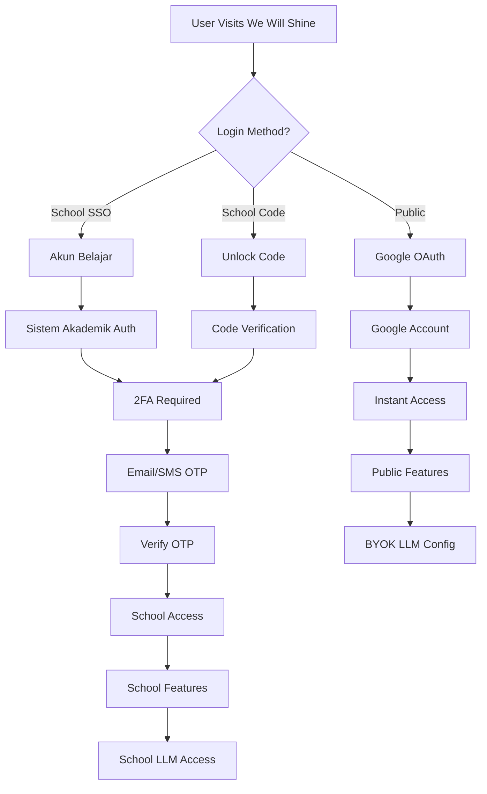

# 🌟 We Will Shine - Vision & Strategy Document

> **Platform Edukasi AI Terbuka & Community-Driven untuk Indonesia**  
> _Empowering Indonesian students with AI that teaches critical thinking_

---

## 📋 Table of Contents

1. [Executive Summary](#executive-summary)
2. [Vision Statement](#vision-statement)
3. [Market Positioning](#market-positioning)
4. [Dual Authentication Strategy](#dual-authentication-strategy)
5. [Technical Architecture](#technical-architecture)
6. [Business Model](#business-model)
7. [Competitive Analysis](#competitive-analysis)
8. [Growth Strategy](#growth-strategy)
9. [Risk Assessment](#risk-assessment)
10. [Action Plan](#action-plan)

---

## 🎯 Executive Summary

### **What is We Will Shine?**

We Will Shine is Indonesia's first **community-driven educational AI platform** that serves as an alternative to closed, commercial AI solutions like ChatGPT, Claude, and Blackbox AI. Built on the **2USE AI middleware** with Socratic teaching methodology, it empowers students to think critically rather than receive instant answers.

### **Key Differentiators**

- ✅ **Educational-first**: Designed specifically for learning, not general purpose
- ✅ **Community-driven**: Teachers and educators build AI agents
- ✅ **BYOK (Bring Your Own Key)**: Users control their LLM costs and privacy
- ✅ **Open source**: Free and transparent for students
- ✅ **Indonesian context**: Local language and educational context
- ✅ **Dual access**: Public (Google OAuth) + School-affiliated (Sistem Akademik)

### **Target Market**

- **Primary**: 50+ million students in Indonesia (SMP, SMA, Kuliah)
- **Secondary**: 1,000+ schools using Sistem Akademik PT Koneksi
- **Tertiary**: Educational institutions seeking AI integration

---

## 🌟 Vision Statement

### **Mission**

To democratize educational AI in Indonesia by providing an open, community-driven platform that teaches critical thinking through Socratic methodology, while maintaining student privacy and educational integrity.

### **Vision**

Become the **largest educational AI platform in Indonesia** by 2025, serving 1+ million students across 1,000+ schools, with a thriving community of educators building and sharing AI learning agents.

### **Core Values**

1. **Educational Integrity**: AI that teaches, not cheats
2. **Privacy First**: Student data belongs to students
3. **Community Driven**: Educators build the future
4. **Open Source**: Transparent and accessible
5. **Indonesian Context**: Built for local needs

---

## 🎯 Market Positioning

### **Current Market Landscape**

```
┌─────────────────────────────────────────────────────┐
│                                                     │
│            Educational Focus ↑                      │
│                                                     │
│  We Will Shine ★                                    │
│  (Educational + Community + Open)                   │
│                                                     │
│            Khan Academy                             │
│            Duolingo                                 │
│                                                     │
│  ←──────────────────┼──────────────────→          │
│  Closed/Paid        │        Open/Free             │
│                     │                               │
│        ChatGPT      │      Cici                     │
│        Claude       │      Blackbox                 │
│        Perplexity   │      Character AI             │
│                     │                               │
│       General Purpose ↓                             │
└─────────────────────────────────────────────────────┘
```

### **Positioning Statement**

> "We Will Shine is the **only educational AI platform in Indonesia** that combines Socratic teaching methodology with community-driven agent development, offering both free public access and deep school integration through PT Koneksi's Sistem Akademik."

### **Unique Value Proposition**

**For Students:**

- 🧠 Learn critical thinking, not copy-paste answers
- 🔒 Privacy-first (your data, your control)
- 💰 Free or BYOK (no vendor lock-in)
- 🎯 Educational context built-in

**For Teachers:**

- 🛠️ Build custom AI agents for your subjects
- 📊 Monitor student progress and engagement
- 🔄 Integrate with existing school systems
- 👥 Share and discover teaching resources

**For Schools:**

- 🏫 Complete integration with Sistem Akademik
- 📈 Data-driven insights on student learning
- 💰 Cost-effective AI implementation
- 🛡️ Compliance with Indonesian education regulations

---

## 🔐 Dual Authentication Strategy

### **Overview**

We Will Shine offers two distinct access paths to serve different user needs while maximizing market reach and revenue potential.

### **Path 1: Public Access (B2C)**

#### **Target Users**

- Individual students (SMP, SMA, Kuliah)
- Homeschoolers and self-learners
- Teachers exploring AI tools
- General public interested in educational AI

#### **Authentication Method**

- **Google OAuth**: One-click sign-in with Google account
- **No school affiliation required**
- **Instant access** to full platform

#### **Features**

- ✅ Full We Will Shine app access
- ✅ 2USE AI with Socratic methodology
- ✅ Personal roadmap and productivity tools
- ✅ Mental health support
- ✅ BYOK (Bring Your Own Key) for LLM access
- ✅ Community agent marketplace

#### **Data & Privacy**

- 💾 Data stored in user's Google account
- 🔒 Private and personal
- ❌ NOT synced to any school system
- ✅ User owns and controls their data

#### **Cost Model**

- 🆓 Platform free forever
- 💰 User pays for their own LLM usage
- 💡 Recommendations for free/low-cost options

### **Path 2: School Affiliated (B2B)**

#### **Target Users**

- Schools using Sistem Akademik PT Koneksi
- Students with school-provided accounts
- Teachers and administrators
- Parents (monitoring access)

#### **Authentication Methods**

**Option A: School SSO**

- 🎓 Single Sign-On with Sistem Akademik
- 👤 Username: `student@sekolahku.sch.id`
- 🔐 Password: School-managed
- 🔒 2FA: Email/SMS verification

**Option B: Unlock Code**

- 🎁 Admin-generated unlock codes
- 📝 Student enters code on login page
- 🔒 2FA: Email/SMS verification
- ⏰ Codes expire after 24 hours

#### **Enhanced Features**

- ✅ All public features PLUS:
- 🔄 Sync with Sistem Akademik
- 📊 Progress monitoring by teachers/BK
- 🏫 School-provided LLM access (free for students)
- 👥 Class-based collaboration
- 📝 Assignment integration
- 👨‍👩‍👧‍👦 Parent dashboard access

#### **Data & Privacy**

- 💾 Data stored in Sistem Akademik
- 👨‍🏫 Visible to authorized teachers/BK only
- 🔒 GDPR/privacy compliant
- 📋 Parental consent workflows

#### **Cost Model**

- 🆓 Free for students
- 💰 School pays subscription (Rp 500k-2jt/month)
- 📦 Bundled with Sistem Akademik

---

## 🏗️ Technical Architecture

### **Authentication Flow**



### **User Profile Structure**

```typescript
interface User {
	id: string;
	name: string;
	email: string;

	// Authentication type
	authType: 'google' | 'schoolSSO' | 'unlockCode';

	// Public user data
	googleId?: string;

	// School user data
	schoolId?: string;
	studentId?: string;
	class?: string;
	grade?: string;

	// LLM Configuration
	llmConfig: {
		provider: 'gemini' | 'openai' | 'claude' | 'ollama' | 'school';
		apiKey?: string; // BYOK
		useSchoolLLM?: boolean; // School-provided
	};

	// Feature permissions
	features: {
		personalRoadmap: boolean;
		aiMentor: boolean;
		mentalHealth: boolean;
		schoolSync: boolean; // School users only
		communityAgents: boolean;
		agentBuilder: boolean; // Teachers only
	};

	// Privacy settings
	privacy: {
		dataSharing: 'private' | 'school' | 'community';
		analytics: boolean;
		marketing: boolean;
	};
}
```

### **2FA Implementation**

```typescript
// School users 2FA flow
async function schoolLogin(identifier: string, password?: string, authMethod: 'sso' | 'code') {
	// Step 1: Primary authentication
	let user;

	if (authMethod === 'sso') {
		user = await sistemAkademik.ssoLogin(identifier, password);
	} else {
		user = await db.getStudentByCode(identifier);
	}

	if (!user) throw new Error('Login failed');

	// Step 2: Generate 2FA
	const otp = generateOTP(6);
	const expiresAt = Date.now() + 10 * 60 * 1000; // 10 minutes

	// Store temporarily
	await redis.set(`2fa:${user.id}`, {
		otp,
		expiresAt,
		attempts: 0
	});

	// Step 3: Send 2FA code
	if (user.email) {
		await sendEmail(user.email, `Kode 2FA We Will Shine: ${otp}`);
	}

	if (user.phone) {
		await sendSMS(user.phone, `Kode 2FA: ${otp}`);
	}

	return {
		sessionId: user.id,
		method: user.email ? 'email' : 'sms',
		maskedContact: maskContact(user.email || user.phone)
	};
}
```

---

## 💰 Business Model

### **Revenue Streams**

#### **Stream 1: Public Users (B2C)**

- **Revenue**: $0 (platform free)
- **Goal**: Viral growth and market share
- **Benefits**:
  - Market dominance
  - Community agents
  - Brand awareness
  - Future upsell opportunities

#### **Stream 2: School Users (B2B)**

- **Revenue**: Rp 500k - 2jt/month per school
- **Package**: Sistem Akademik + We Will Shine
- **Benefits**:
  - Recurring revenue
  - Deep integration
  - Customer lock-in
  - Expansion opportunities

### **Cost Structure**

#### **Platform Costs**

- **Infrastructure**: Rp 5jt/month (servers, CDN, database)
- **Development**: Rp 50jt/month (team salaries)
- **Marketing**: Rp 10jt/month (growth initiatives)
- **Total**: Rp 65jt/month

#### **Revenue Projections**

**Year 1:**

- Schools: 10 × Rp 1jt = Rp 10jt/month
- Public users: 1,000 (no revenue)
- **Total**: Rp 10jt/month

**Year 2:**

- Schools: 50 × Rp 1jt = Rp 50jt/month
- Public users: 10,000 (no revenue)
- **Total**: Rp 50jt/month

**Year 3:**

- Schools: 100 × Rp 1jt = Rp 100jt/month
- Public users: 100,000 (no revenue)
- **Total**: Rp 100jt/month

### **Unit Economics**

#### **School Customer**

- **LTV**: Rp 24jt (2 years × Rp 1jt/month)
- **CAC**: Rp 2jt (sales + onboarding)
- **LTV/CAC**: 12:1 ✅
- **Payback**: 2 months ✅

#### **Public User**

- **LTV**: Rp 0 (free)
- **CAC**: Rp 500 (marketing)
- **Goal**: Network effects and brand building

---

## 🏆 Competitive Analysis

### **Direct Competitors**

#### **vs ChatGPT**

```
ChatGPT:
✅ Powerful LLM capabilities
❌ Expensive ($20/month)
❌ Instant answers (students copy-paste)
❌ No educational context
❌ One-size-fits-all approach

We Will Shine:
✅ Multiple LLM support (BYOK)
✅ Free platform + flexible pricing
✅ Socratic method (teaches thinking)
✅ Educational context built-in
✅ Customizable for different subjects
```

#### **vs Cici (Character AI Indonesia)**

```
Cici:
✅ Indonesian language support
✅ Character-based interactions
❌ General chatbot (not educational)
❌ Entertainment-focused
❌ No learning productivity tools

We Will Shine:
✅ Indonesian language + context
✅ Educational AI agents
✅ Learning productivity features
✅ Mental health support
✅ School integration
```

#### **vs Blackbox AI**

```
Blackbox AI:
✅ Developer-focused tools
✅ Code generation
❌ Not educational
❌ Instant answers
❌ No learning methodology

We Will Shine:
✅ Student-focused
✅ Educational methodology
✅ Socratic teaching
✅ Critical thinking development
✅ Learning productivity tools
```

### **Competitive Advantages**

1. **Educational Focus**: Only platform designed specifically for learning
2. **Community-Driven**: Teachers build agents, not just developers
3. **BYOK Model**: Users control costs and privacy
4. **Indonesian Context**: Local language and educational system
5. **School Integration**: Deep integration with existing systems
6. **Open Source**: Transparent and trustworthy
7. **2USE Technology**: Proprietary Socratic AI engine

---

## 📈 Growth Strategy

### **Phase 1: Foundation (Months 1-6)**

#### **Goals**

- Perfect We Will Shine v2.0 platform
- Launch with 1 pilot school (SMP IT Masjid Syuhada)
- Reach 100 active users
- Establish product-market fit

#### **Key Activities**

- ✅ Complete routing refactor (done)
- 🔜 Build landing page with full vision
- 🔜 Implement Google OAuth
- 🔜 Add BYOK LLM configuration
- 🔜 Test with 22 students
- 🔜 Gather feedback and iterate

#### **Success Metrics**

- 100+ active users
- 80%+ user satisfaction
- 5+ community agents created
- 1 school successfully integrated

### **Phase 2: Growth (Months 7-18)**

#### **Goals**

- Scale to 10 schools
- Reach 10,000 active users
- Launch 2USE Dashboard (teacher tools)
- Build community marketplace

#### **Key Activities**

- 🏫 Onboard 9 additional schools
- 🛠️ Develop 2USE Dashboard MVP
- 👨‍🏫 Recruit 50 teacher contributors
- 📱 Launch mobile app
- 📊 Implement analytics dashboard
- 🎯 Content marketing campaign

#### **Success Metrics**

- 10 schools using platform
- 10,000+ active users
- 100+ community agents
- Rp 10jt/month revenue

### **Phase 3: Scale (Months 19-36)**

#### **Goals**

- Scale to 100 schools
- Reach 100,000 active users
- Become market leader
- Regional expansion

#### **Key Activities**

- 🏫 Scale to 100 schools
- 🌍 Launch in Malaysia/Singapore
- 🤝 Government partnerships
- 📺 Media coverage
- 💰 Series A funding
- 🏆 Industry recognition

#### **Success Metrics**

- 100 schools using platform
- 100,000+ active users
- Rp 100jt/month revenue
- Market leadership position

---

## ⚠️ Risk Assessment

### **Technical Risks**

#### **Risk: LLM API Costs**

- **Impact**: High (could make platform unsustainable)
- **Probability**: Medium
- **Mitigation**: BYOK model + school partnerships
- **Status**: ✅ Mitigated

#### **Risk: Scalability Issues**

- **Impact**: Medium (could limit growth)
- **Probability**: Low
- **Mitigation**: Cloud-native architecture + monitoring
- **Status**: 🔄 Monitoring

### **Business Risks**

#### **Risk: Competition from Big Tech**

- **Impact**: High (Google/OpenAI could compete)
- **Probability**: Medium
- **Mitigation**: Community moat + school integration
- **Status**: 🔄 Monitoring

#### **Risk: Regulatory Changes**

- **Impact**: Medium (AI regulations)
- **Probability**: Medium
- **Mitigation**: Compliance-first approach
- **Status**: 🔄 Monitoring

### **Market Risks**

#### **Risk: Slow School Adoption**

- **Impact**: High (limits B2B revenue)
- **Probability**: Medium
- **Mitigation**: Strong pilot results + sales team
- **Status**: 🔄 Monitoring

#### **Risk: Economic Downturn**

- **Impact**: Medium (schools cut budgets)
- **Probability**: Medium
- **Mitigation**: Flexible pricing + value demonstration
- **Status**: 🔄 Monitoring

---

## 📋 Action Plan

### **Immediate (Next 2 Weeks)**

1. ✅ **Complete Platform Foundation**
   - Finish We Will Shine v2.0
   - Fix all routing and authentication
   - Test with current 22 students

2. 🔜 **Build Landing Page**
   - Implement full vision messaging
   - Add dual authentication options
   - Create compelling value propositions

3. 🔜 **Implement Google OAuth**
   - Set up Google OAuth integration
   - Create user profile system
   - Test authentication flow

4. 🔜 **Add BYOK Configuration**
   - Create LLM settings page
   - Implement API key management
   - Add provider recommendations

5. 🔜 **Update Documentation**
   - Complete vision documentation
   - Update technical specs
   - Create user guides

### **Short-term (Months 2-6)**

1. 📝 **Spec 2USE Dashboard**
   - Research n8n architecture
   - Design teacher workflow builder
   - Create technical specifications

2. 🏫 **Pilot School Program**
   - Onboard 3-5 additional schools
   - Implement school SSO integration
   - Test 2FA and monitoring features

3. 👨‍🏫 **Teacher Community**
   - Recruit 10 teacher contributors
   - Build first agent templates
   - Test marketplace concept

4. 📱 **Mobile Development**
   - Design mobile app mockups
   - Develop React Native app
   - Test cross-platform functionality

### **Medium-term (Months 6-12)**

1. 🚀 **Launch 2USE Dashboard**
   - Build workflow builder MVP
   - Create 50 official templates
   - Launch closed beta (100 teachers)

2. 📈 **Scale School Program**
   - Hire sales team
   - Develop partnership strategy
   - Target 50 schools

3. 💰 **Revenue Optimization**
   - Optimize pricing strategy
   - Implement usage analytics
   - Target Rp 50jt/month revenue

### **Long-term (Year 2-3)**

1. 🌍 **Regional Expansion**
   - Launch in Malaysia
   - Partner with Singapore schools
   - Develop multi-language support

2. 🤝 **Strategic Partnerships**
   - Government partnerships (Kemendikbud)
   - University collaborations
   - Corporate training programs

3. 🏆 **Market Leadership**
   - Become #1 educational AI in Indonesia
   - Industry recognition and awards
   - Thought leadership content

---

## 📊 Success Metrics

### **Product Metrics**

- **User Engagement**: DAU/MAU ratio > 30%
- **Feature Adoption**: 80%+ users try AI mentor
- **Community Growth**: 100+ agents by Year 1
- **School Satisfaction**: 90%+ renewal rate

### **Business Metrics**

- **Revenue Growth**: 100% YoY
- **Customer Acquisition**: 50 schools by Year 2
- **Unit Economics**: LTV/CAC > 10:1
- **Market Share**: #1 in Indonesia by Year 3

### **Impact Metrics**

- **Student Outcomes**: Improved critical thinking scores
- **Teacher Productivity**: 50%+ time savings
- **School Performance**: Better academic results
- **Community Value**: 1,000+ shared resources

---

## 🎯 Conclusion

We Will Shine represents a **unique opportunity** to democratize educational AI in Indonesia while building a sustainable, community-driven business. The dual authentication strategy maximizes market reach while the BYOK model ensures long-term viability.

**Key Success Factors:**

1. ✅ **Educational focus** (not general purpose)
2. ✅ **Community-driven** (teachers build agents)
3. ✅ **Open and transparent** (trust and adoption)
4. ✅ **Indonesian context** (local relevance)
5. ✅ **Sustainable model** (BYOK + school partnerships)

**Next Steps:**

1. 🔜 Build compelling landing page
2. 🔜 Implement Google OAuth
3. 🔜 Launch pilot program
4. 🔜 Scale systematically

**This vision is not just ambitious—it's achievable and necessary for Indonesia's educational future.** 🌟

---

_Document Version: 1.0_  
_Last Updated: December 2024_  
_Next Review: January 2025_
